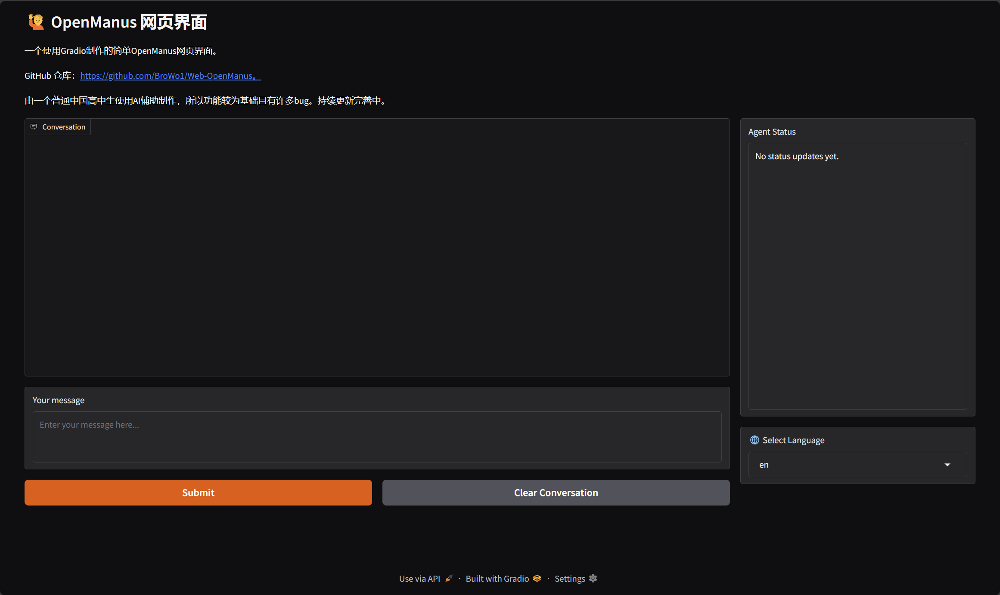

[English](README.md) | 简体中文

# Web OpenManus 🙋

一个基于Gradio的简单OpenManus的WebUI，可视化原先在命令行里的聊天。  
开源项目OpenManus的GitHub仓库请访问 https://github.com/mannaandpoem/OpenManus

作者为一个普通高中生，所以功能十分基础且不完善。持续更新中以来优化UI且跟进OpenManus。 



## 安装指南

1. 创建新的 conda 环境：

```bash
conda create -n open_manus python=3.12
conda activate open_manus
```

2. 克隆仓库：

```bash
git clone https://github.com/BroWo1/Web-OpenManus.git
cd Web-OpenManus
```

3. 安装依赖：

```bash
pip install -r requirements.txt
```

## 配置说明

OpenManus 需要配置使用的 LLM API，请按以下步骤设置：

1. 编辑 `config/config.toml` 添加 API 密钥和自定义设置：

```toml
# 全局 LLM 配置
[llm]
model = "gpt-4o"
base_url = "https://api.openai.com/v1"
api_key = "sk-..."  # 替换为真实 API 密钥
max_tokens = 4096
temperature = 0.0

# 可选特定 LLM 模型配置
[llm.vision]
model = "gpt-4o"
base_url = "https://api.openai.com/v1"
api_key = "sk-..."  # 替换为真实 API 密钥
```

## 快速启动

一行命令运行 OpenManus：

```bash
python web.py
```

然后打开终端中的链接！

## 私货
作者的其他GitHub项目：  
https://github.com/BroWo1/GPE-Hub  
https://github.com/Humanoid-a/gpeclubwebsite